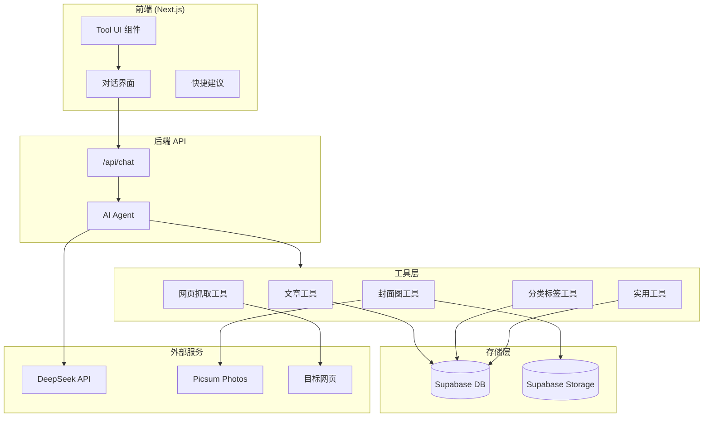
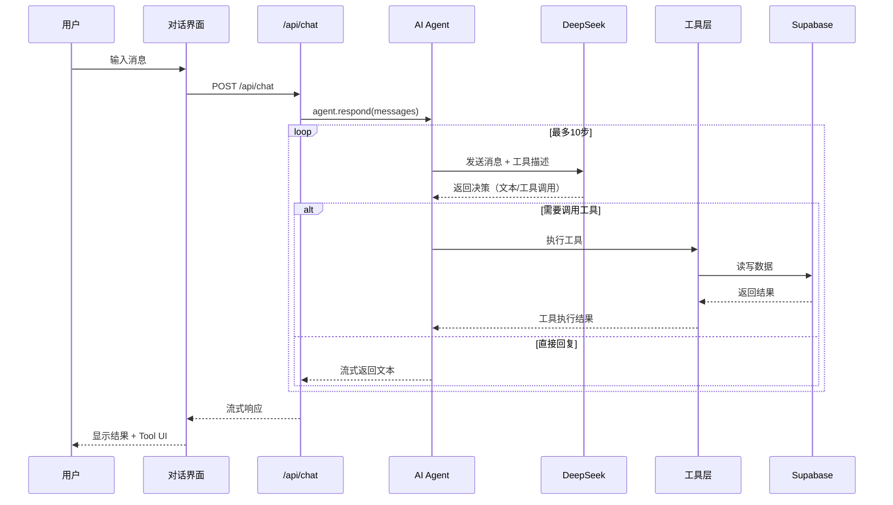
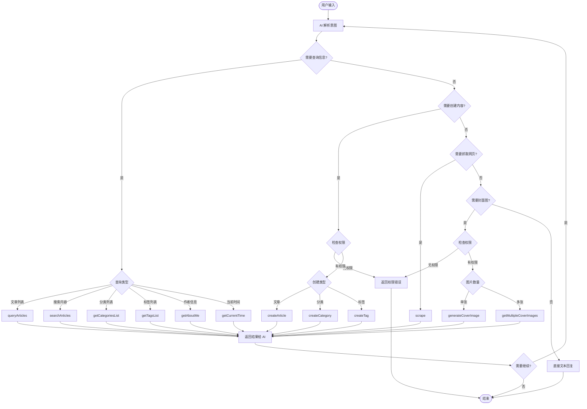
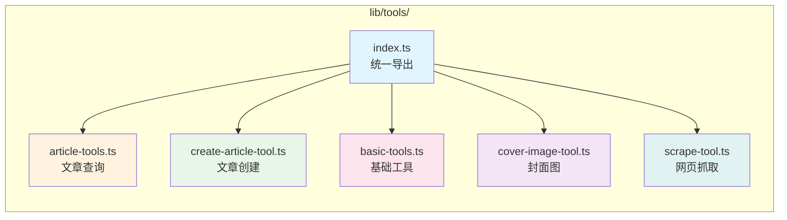
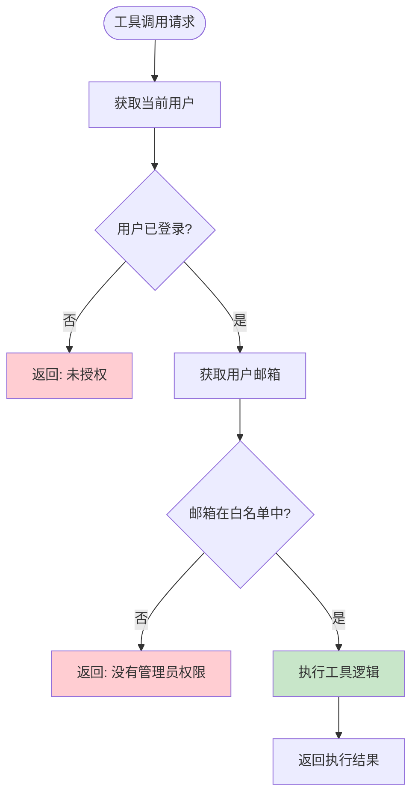
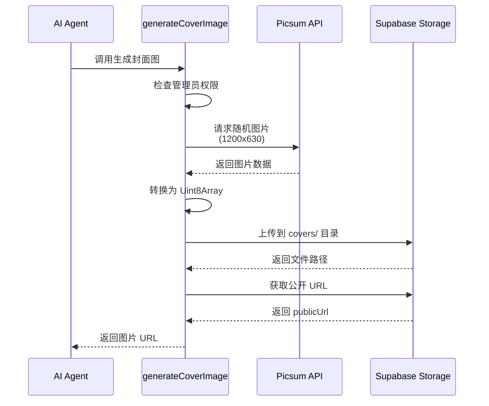
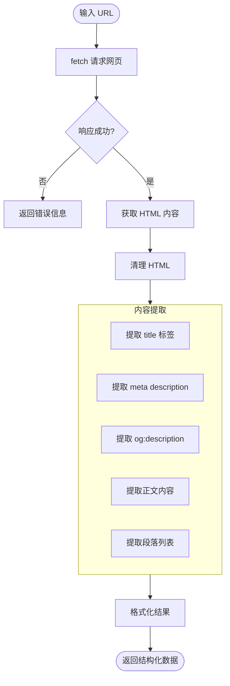
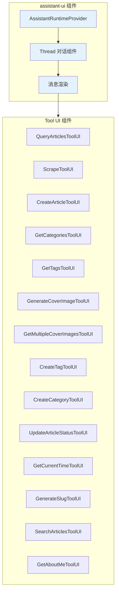

# 我最近做了一个博客 Agent

最近在我的个人博客项目中实现了一个 AI Agent 功能，让 AI 不仅能回答问题，还能真正地帮我管理博客内容。这篇文章记录一下整个实现过程和技术细节。

## 为什么要做博客 Agent？

传统的博客管理需要频繁切换后台界面：写文章、设置分类、上传封面图、发布... 流程繁琐。我想要的是一个能用自然语言交互的助手：

- "帮我把这个网页内容整理成一篇文章"
- "最近有什么文章？"
- "创建一个叫'前端'的分类"

于是就有了这个博客 Agent。

## 技术栈

| 层级 | 技术选型 | 说明 |
|-----|---------|------|
| 前端框架 | Next.js 15 + React | App Router + Server Components |
| AI SDK | Vercel AI SDK | 使用 `Experimental_Agent` |
| 大模型 | DeepSeek Reasoner | 支持推理的国产大模型 |
| 数据库 | Supabase (PostgreSQL) | 存储文章、分类、标签等 |
| 对象存储 | Supabase Storage | 存储封面图片 |
| UI 组件 | assistant-ui/react | AI 对话界面组件库 |

## 系统架构

### 整体架构图



### Agent 执行流程



### 工具调用决策流程



## 核心设计

### Agent 定义

使用 Vercel AI SDK 的 `Experimental_Agent` 创建 Agent：

```typescript
import { Experimental_Agent as Agent, stepCountIs } from "ai";
import { createDeepSeek } from "@ai-sdk/deepseek";

const createBlogAssistantAgent = () => {
  const deepseek = createDeepSeek({
    baseURL: "https://api.deepseek.com/v1",
    apiKey: process.env.DEEPSEEK_API_KEY,
  })("deepseek-reasoner");

  return new Agent({
    model: deepseek,
    system: `你是 Boice 博客的智能助手，既能帮助访客了解博客内容，也能协助管理员管理博客。

## 角色定位：
- 对普通访客：友好地介绍博客、推荐文章、回答关于作者和内容的问题
- 对管理员：协助创建文章、管理分类标签、抓取网页内容

## 行为准则：
1. 当用户询问"你是谁"或"作者是谁"时，使用 getAboutMe 工具获取作者信息
2. 创建/修改内容默认为草稿状态，除非用户明确要求发布
3. 执行创建操作前先确认用户需求
4. 根据用户问题自动选择合适的工具`,
    tools: { /* 工具集 */ },
    stopWhen: stepCountIs(10),
  });
};
```

关键设计决策：
- **系统提示词保持简洁**：不需要详细列举每个工具的用法，工具有自己的 description，AI 会自动理解
- **步数限制**：使用 `stepCountIs(10)` 防止无限循环
- **角色双重性**：同时服务访客和管理员

### 工具模块设计



#### 工具清单

| 工具名 | 模块 | 功能 | 需要权限 |
|-------|------|------|---------|
| `queryArticles` | article-tools | 查询已发布文章列表 | ❌ |
| `searchArticles` | basic-tools | 全文搜索文章内容 | ❌ |
| `createArticle` | create-article-tool | 创建新文章 | ✅ |
| `updateArticleStatus` | basic-tools | 更新文章状态 | ✅ |
| `getCategoriesList` | create-article-tool | 获取分类列表 | ❌ |
| `getTagsList` | create-article-tool | 获取标签列表 | ❌ |
| `createCategory` | basic-tools | 创建新分类 | ✅ |
| `createTag` | basic-tools | 创建新标签 | ✅ |
| `generateCoverImage` | cover-image-tool | 生成单张封面图 | ✅ |
| `getMultipleCoverImages` | cover-image-tool | 生成多张封面图 | ✅ |
| `scrape` | scrape-tool | 抓取网页内容 | ❌ |
| `getCurrentTime` | basic-tools | 获取当前时间 | ❌ |
| `generateSlug` | basic-tools | 生成 URL slug | ❌ |
| `getAboutMe` | basic-tools | 获取作者介绍 | ❌ |

### 工具定义规范

每个工具使用 Vercel AI SDK 的 `tool` 函数定义：

```typescript
import { tool } from "ai";
import { z } from "zod";

export const createArticleTool = tool({
  // 详细的描述帮助 AI 理解何时使用此工具
  description: `创建一篇新文章到博客系统。需要提供文章标题和内容，可选提供描述、分类、标签和状态。
使用场景：
- 用户要求根据抓取的网页内容创建文章
- 用户要求创建新文章
- 用户提供内容让你整理成文章`,

  // 使用 Zod 定义输入参数，每个参数都有详细描述
  inputSchema: z.object({
    title: z.string().min(1).max(200).describe("文章标题"),
    content: z.string().min(1).describe("文章正文内容（支持 Markdown 格式）"),
    description: z.string().max(500).optional().describe("文章简短描述/摘要"),
    categoryId: z.number().optional().describe("分类 ID"),
    tagIds: z.array(z.number()).optional().describe("标签 ID 数组"),
    status: z.enum(["draft", "published"]).optional().describe("文章状态"),
    image: z.string().url().optional().describe("文章封面图片 URL"),
  }),

  // 执行函数
  execute: async (args) => {
    // 1. 权限检查
    const hasAccess = await checkDashboardAccess();
    if (!hasAccess) {
      return { success: false, error: "没有权限执行此操作" };
    }
    
    // 2. 执行业务逻辑
    const result = await createArticle(args);
    
    // 3. 返回结构化结果
    return {
      success: true,
      message: `文章「${args.title}」创建成功！`,
      article: result.data,
    };
  },
});
```

## 权限控制设计

### 权限检查流程



### 权限检查实现

```typescript
// lib/actions/auth-actions.ts

// 从环境变量获取管理员邮箱列表
function getAdminEmails(): string[] {
  const adminEmails = process.env.ADMIN_EMAILS || '';
  return adminEmails
    .split(',')
    .map(email => email.trim().toLowerCase())
    .filter(Boolean);
}

export async function checkDashboardAccess(): Promise<boolean> {
  const supabase = await createClient();
  const { data: { user } } = await supabase.auth.getUser();
  
  // 未登录
  if (!user || !user.email) {
    return false;
  }
  
  const adminEmails = getAdminEmails();
  
  // 如果没有配置白名单，默认允许所有登录用户
  if (adminEmails.length === 0) {
    return true;
  }
  
  // 检查是否在白名单中
  return adminEmails.includes(user.email.toLowerCase());
}
```

### 工具中集成权限检查

```typescript
export const createTagTool = tool({
  description: "创建一个新的文章标签",
  inputSchema: z.object({
    name: z.string().min(1).max(50).describe("标签名称"),
    slug: z.string().optional().describe("标签别名"),
  }),
  execute: async ({ name, slug }) => {
    // ⚠️ 权限检查前置
    const hasAccess = await checkDashboardAccess();
    if (!hasAccess) {
      return {
        success: false,
        error: "没有权限执行此操作，需要管理员权限",
        tag: null,
      };
    }

    // 执行实际逻辑
    const result = await createTag(name, slug);
    return { success: true, tag: result.data };
  },
});
```

## 封面图生成方案

### 流程设计



### 实现代码

```typescript
// 使用 Picsum Photos API（免费、无需 API Key）
const PICSUM_URL = "https://picsum.photos";
const DEFAULT_WIDTH = 1200;
const DEFAULT_HEIGHT = 630;

async function downloadAndUploadImage(imageSourceUrl: string): Promise<string> {
  const supabase = await createClient();

  // 1. 下载图片
  const response = await fetch(imageSourceUrl, {
    headers: { "User-Agent": "Mozilla/5.0 (compatible; BlogAssistant/1.0)" },
  });
  
  if (!response.ok) {
    throw new Error(`下载图片失败: ${response.status}`);
  }

  // 2. 转换为二进制数据
  const arrayBuffer = await response.arrayBuffer();
  const uint8Array = new Uint8Array(arrayBuffer);

  // 3. 生成唯一文件名
  const timestamp = Date.now();
  const randomStr = Math.random().toString(36).substring(2, 8);
  const filePath = `covers/${timestamp}-${randomStr}.jpg`;

  // 4. 上传到 Supabase Storage
  const { data, error } = await supabase.storage
    .from("article-images")
    .upload(filePath, uint8Array, {
      cacheControl: "3600",
      contentType: "image/jpeg",
    });

  if (error) throw new Error(`上传图片失败: ${error.message}`);

  // 5. 获取公开 URL
  const { data: urlData } = supabase.storage
    .from("article-images")
    .getPublicUrl(data.path);

  return urlData.publicUrl;
}

export const generateCoverImageTool = tool({
  description: "生成一张随机封面图并保存到服务器",
  inputSchema: z.object({}),
  execute: async () => {
    // 权限检查
    const hasAccess = await checkDashboardAccess();
    if (!hasAccess) {
      return { success: false, error: "需要管理员权限" };
    }

    // 生成带随机 seed 的 URL
    const seed = `${Date.now()}-${Math.random().toString(36).substring(7)}`;
    const sourceUrl = `${PICSUM_URL}/seed/${seed}/${DEFAULT_WIDTH}/${DEFAULT_HEIGHT}`;

    const imageUrl = await downloadAndUploadImage(sourceUrl);
    return { success: true, imageUrl, message: "已生成并保存封面图" };
  },
});
```

## 网页抓取方案

### 抓取流程



### 内容提取策略

```typescript
export const scrapeTool = tool({
  description: "抓取指定网页的内容，获取标题、描述和正文",
  inputSchema: z.object({
    url: z.string().url().describe("要抓取的网页 URL"),
  }),
  execute: async ({ url }) => {
    const response = await fetch(url, {
      headers: {
        "User-Agent": "Mozilla/5.0 (Windows NT 10.0; Win64; x64) ...",
        "Accept": "text/html,application/xhtml+xml,...",
        "Accept-Language": "zh-CN,zh;q=0.9,en;q=0.8",
      },
    });

    const html = await response.text();

    // 1. 提取标题
    const title = html.match(/<title[^>]*>([^<]+)<\/title>/i)?.[1]?.trim();

    // 2. 提取 meta description
    const description = html.match(
      /<meta[^>]*name=["']description["'][^>]*content=["']([^"']+)["']/i
    )?.[1]?.trim();

    // 3. 提取 og:description 作为备选
    const ogDescription = html.match(
      /<meta[^>]*property=["']og:description["'][^>]*content=["']([^"']+)["']/i
    )?.[1]?.trim();

    // 4. 清理并提取正文
    let cleanHtml = html
      .replace(/<script\b[^<]*(?:(?!<\/script>)<[^<]*)*<\/script>/gi, "")
      .replace(/<style\b[^<]*(?:(?!<\/style>)<[^<]*)*<\/style>/gi, "")
      .replace(/<!--[\s\S]*?-->/g, "");

    // 5. 优先从 article > main > body 提取
    const articleMatch = cleanHtml.match(/<article[^>]*>([\s\S]*?)<\/article>/i);
    const mainMatch = cleanHtml.match(/<main[^>]*>([\s\S]*?)<\/main>/i);
    const bodyMatch = cleanHtml.match(/<body[^>]*>([\s\S]*?)<\/body>/i);
    
    const content = (articleMatch || mainMatch || bodyMatch)?.[1] || "";

    // 6. 提取纯文本
    const textContent = content
      .replace(/<[^>]+>/g, " ")
      .replace(/\s+/g, " ")
      .trim()
      .substring(0, 10000);

    return {
      success: true,
      url,
      title,
      description: description || ogDescription,
      content: textContent,
      wordCount: textContent.length,
    };
  },
});
```

## 自定义 Tool UI

### UI 组件架构



### Tool UI 实现模式

```typescript
import { makeAssistantToolUI } from "@assistant-ui/react";

// 定义结果类型
type QueryArticlesResult = {
  success: boolean;
  error?: string;
  articles: Article[];
  total: number;
};

// 创建 Tool UI 组件
export const QueryArticlesToolUI = makeAssistantToolUI<
  Record<string, never>,  // 输入参数类型
  QueryArticlesResult      // 返回结果类型
>({
  toolName: "queryArticles",  // 对应工具名
  render: ({ result, status }) => {
    return (
      <div className="my-2 rounded-lg border bg-card p-3">
        {/* 标题栏 */}
        <div className="mb-2 flex items-center gap-2 text-sm font-medium">
          <FileTextIcon className="h-4 w-4 text-blue-500" />
          <span>查询文章</span>
        </div>

        {/* 加载状态 */}
        {status.type === "running" && (
          <div className="flex items-center gap-2 text-sm text-muted-foreground">
            <Loader2Icon className="h-4 w-4 animate-spin" />
            <span>正在查询文章...</span>
          </div>
        )}

        {/* 结果展示 */}
        {result && (
          <div className="space-y-2">
            {result.success ? (
              <>
                <div className="flex items-center gap-1 text-sm text-green-600">
                  <CheckCircleIcon className="h-4 w-4" />
                  <span>找到 {result.total} 篇文章</span>
                </div>
                {/* 文章列表 */}
                <div className="max-h-48 space-y-1 overflow-y-auto">
                  {result.articles.slice(0, 5).map((article) => (
                    <div key={article.id} className="rounded bg-muted/50 px-2 py-1 text-xs">
                      <div className="font-medium">{article.title}</div>
                    </div>
                  ))}
                </div>
              </>
            ) : (
              <div className="flex items-center gap-1 text-sm text-red-500">
                <XCircleIcon className="h-4 w-4" />
                <span>{result.error}</span>
              </div>
            )}
          </div>
        )}
      </div>
    );
  },
});
```

### Tool UI 样式规范

| 工具类型 | 图标 | 颜色 |
|---------|------|------|
| 文章查询 | FileTextIcon | blue-500 |
| 网页抓取 | GlobeIcon | purple-500 |
| 创建文章 | PlusCircleIcon | green-500 |
| 分类相关 | FolderIcon | orange-500 |
| 标签相关 | TagIcon | cyan-500 |
| 封面图 | ImageIcon / ImagesIcon | pink-500 / violet-500 |
| 时间 | ClockIcon | indigo-500 |
| Slug | LinkIcon | emerald-500 |
| 搜索 | SearchIcon | amber-500 |
| 状态更新 | RefreshCwIcon | blue-500 |
| 作者信息 | UserIcon | teal-500 |

### 注册 Tool UI

```typescript
// app/[locale]/app.tsx

import {
  QueryArticlesToolUI,
  ScrapeToolUI,
  CreateArticleToolUI,
  // ... 其他导入
  GetAboutMeToolUI,
} from "@/components/assistant-ui/tool-ui";

function AssistantProvider({ children, userId }) {
  // ... runtime 配置

  return (
    <AssistantRuntimeProvider runtime={runtime}>
      {/* 注册所有 Tool UI */}
      <QueryArticlesToolUI />
      <ScrapeToolUI />
      <CreateArticleToolUI />
      <GetCategoriesToolUI />
      <GetTagsToolUI />
      <GenerateCoverImageToolUI />
      <GetMultipleCoverImagesToolUI />
      <CreateTagToolUI />
      <CreateCategoryToolUI />
      <UpdateArticleStatusToolUI />
      <GetCurrentTimeToolUI />
      <GenerateSlugToolUI />
      <SearchArticlesToolUI />
      <GetAboutMeToolUI />
      {children}
    </AssistantRuntimeProvider>
  );
}
```

## 前端交互设计

### 快捷建议按钮

```typescript
const suggestions = [
  {
    title: "最近有什么文章",
    label: "查询博客文章列表",
    action: "最近有什么文章？",
    autoSend: true,  // 点击后自动发送
  },
  {
    title: "了解作者",
    label: "获取博客作者介绍",
    action: "介绍一下这个博客的作者",
    autoSend: true,
  },
  {
    title: "抓取网页创建文章",
    label: "从网页内容生成文章",
    action: "帮我抓取一个网页的内容并创建一篇文章",
    autoSend: false, // 填充到输入框，等待用户补充
  },
  {
    title: "搜索文章内容",
    label: "通过关键词查找文章",
    action: "帮我搜索关于",
    autoSend: false,
  },
  {
    title: "现在几点了",
    label: "获取当前时间",
    action: "现在几点了？",
    autoSend: true,
  },
  {
    title: "创建新标签",
    label: "添加文章标签",
    action: "帮我创建一个叫做",
    autoSend: false,
  },
  {
    title: "创建新分类",
    label: "添加文章分类",
    action: "帮我创建一个叫做",
    autoSend: false,
  },
];
```

## 实际使用场景

### 场景 1：从网页创建文章

```mermaid
sequenceDiagram
    participant User as 用户
    participant Agent as AI Agent
    participant Scrape as scrape 工具
    participant Category as getCategoriesList
    participant Cover as generateCoverImage
    participant Create as createArticle

    User->>Agent: 帮我把 https://example.com/post 整理成文章
    Agent->>Scrape: 抓取网页
    Scrape-->>Agent: 返回标题、内容
    Agent->>Category: 获取分类列表
    Category-->>Agent: 返回分类
    Agent->>Cover: 生成封面图
    Cover-->>Agent: 返回图片 URL
    Agent->>Create: 创建文章
    Create-->>Agent: 文章创建成功
    Agent-->>User: 文章「xxx」已创建为草稿
```

### 场景 2：内容查询

```
用户：最近关于 React 的文章有哪些？

Agent：
  → 调用 searchArticles(keyword: "React")
  ← 找到 3 篇文章

回复：找到 3 篇关于 React 的文章：
1. 《React 18 新特性解析》
2. 《使用 React Server Components》
3. 《React 性能优化实践》
```

### 场景 3：了解博客

```
用户：你是谁？这是谁的博客？

Agent：
  → 调用 getAboutMe(locale: "zh")
  ← 返回作者介绍

回复：这是 Boice 的个人博客。[作者介绍内容...]
```

## 项目结构

```
lib/tools/
├── index.ts                 # 统一导出所有工具
├── article-tools.ts         # queryArticlesTool
├── create-article-tool.ts   # createArticleTool, getCategoriesListTool, getTagsListTool
├── basic-tools.ts           # createTagTool, createCategoryTool, updateArticleStatusTool,
│                            # getCurrentTimeTool, generateSlugTool, searchArticlesTool, getAboutMeTool
├── cover-image-tool.ts      # generateCoverImageTool, getMultipleCoverImagesTool
└── scrape-tool.ts           # scrapeTool

components/assistant-ui/
├── tool-ui.tsx              # 所有 Tool UI 组件
├── thread.tsx               # 对话主界面 + 快捷建议
├── assistant-modal.tsx      # 悬浮窗模式
└── ...

app/
├── api/chat/route.ts        # Agent API 端点
└── [locale]/app.tsx         # Tool UI 注册
```

## 总结

这个博客 Agent 的核心设计原则：

1. **工具即能力**：把博客管理的各种操作抽象成独立工具，让 AI 自己决定调用哪个
2. **权限分离**：只读操作对所有人开放，写操作需要管理员权限验证
3. **良好的 UX**：自定义 Tool UI 让用户清楚看到 AI 在做什么
4. **简洁的提示词**：不需要教 AI 怎么用工具，它会自己读工具的 description
5. **模块化设计**：工具按功能分文件，便于维护和扩展

整个实现大概 1500+ 行代码，但带来的体验提升是显著的。现在写博客，只需要和 AI 聊几句就行了。

---

*技术栈：Next.js 15 / Vercel AI SDK / DeepSeek Reasoner / Supabase / assistant-ui*

*项目地址：[GitHub](https://github.com/boice/boice)*


